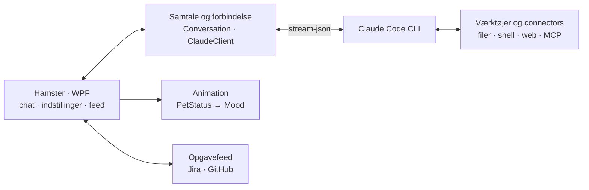
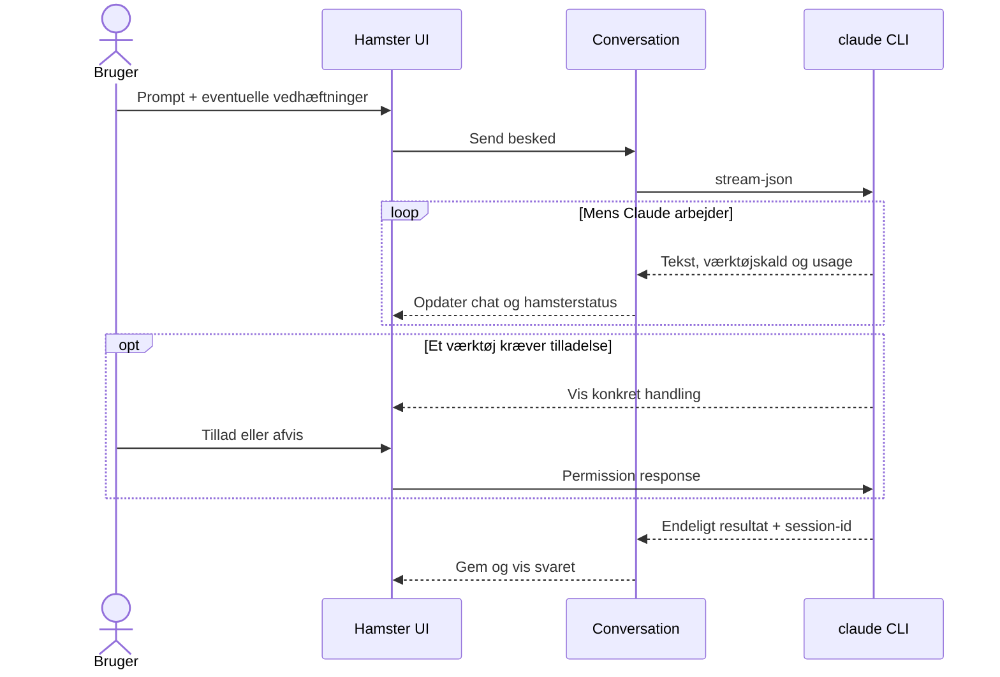

<p align="center">
  
</p>

<h1 align="center">Hamster</h1>

<p align="center">
  En lille Windows-makker til Claude Code, som bor på skrivebordet, hjælper i dine mapper og holder øje med dine opgaver.
</p>

Hamster giver Claude Code en lille Windows-brugerflade. Animationerne viser, om Claude arbejder, venter på din tilladelse eller er færdig, uden at du behøver åbne chatten.

## Det får du

- **Claude Code på skrivebordet** – vælg model, reasoning effort og permission mode direkte i appen.
- **Chat med kontekst** – arbejd uden mappe eller giv Claude adgang til et konkret projekt; samtaler kan genoptages og eksporteres som Markdown.
- **Filer og billeder** – drag-and-drop, clipboard og Windows' skærmklip er bygget ind.
- **En hamster med situationsfornemmelse** – 16 animationer reagerer på aktivitet, fejl, research, musik og nye svar.
- **Opgavefeed** – følg Jira-sager og GitHub-pull requests med automatisk opdatering.
- **Connectors** – installer Atlassian Rovo og GitHub gennem Hamster, eller brug Microsoft 365 via Claude.ai.
- **Personlig opsætning** – dansk/engelsk, egne prompts, temaer og sprite-karakterer.
- **Små desktop-detaljer** – flere hamster-vinduer, auto-hide, always-on-top og styring af den aktuelle medieafspiller.

## Kom hurtigt i gang

### Krav

- Windows 10 build 19041 eller nyere – en supporteret Windows-version anbefales
- [.NET 10 SDK](https://dotnet.microsoft.com/download/dotnet/10.0)
- [Git for Windows](https://git-scm.com/downloads/win) – valgfrit, men anbefalet for Bash-understøttelse
- [Claude Code](https://docs.anthropic.com/en/docs/claude-code/getting-started) installeret, logget ind og tilgængelig som `claude` i `PATH`
- [WebView2 Runtime](https://developer.microsoft.com/en-us/microsoft-edge/webview2/) – kun nødvendigt til Jira-web-login; er ofte allerede installeret

### Kør fra kildekoden

```powershell
dotnet run --project .\src\Hamster\Hamster.csproj
```

Hamster starter en Claude Code-session, når hovedvinduet er indlæst. Vælg **Mappe**, hvis Claude skal arbejde i et bestemt projekt, eller behold **Chat** for en samtale i Hamsters eget workspace.

### Installer med autostart

```powershell
.\install_autostart.ps1
```

Scriptet publicerer en single-file release til `publish\`, opretter en genvej i Windows Startup og starter Hamster.

## Sådan hænger det sammen



`App` samler afhængighederne. `MainWindow` styrer desktopoplevelsen, mens domænelogikken ligger i `Hamster.Core`. Selve Claude-processen kører separat og kommunikerer med appen som newline-separeret JSON over standard input/output.

Opgavefeedet henter data via MCP, Claude Code eller Jira-web-login, afhængigt af den valgte connector.

### En prompt gennem systemet



Tilladelser vises i appen med værktøjets konkrete handling. **Tillad altid** gælder kun for den aktuelle session og det scope, Claude sender med forespørgslen.

## Hamsterens humør er programstatus

Animationerne er ikke tilfældige. `PetStatus` oversætter den aktuelle tilstand til et `Mood`, og `MoodTransition` sørger for rene skift mellem spritesheets.

| Når… | Så… |
|---|---|
| Claude arbejder | spinner hamsteren |
| Claude browser eller researcher | læser den koncentreret |
| en handling kræver godkendelse | gør den opmærksom på sig selv |
| et svar er klart | fejrer den |
| noget fejler | bliver den trist |
| feedet har nyt | lyser den op |
| musik spiller eller baggrundsopgaver kører | danser den |
| der er ro på | falder den i søvn |

## Projektet

```text
hamster-pet/
├─ src/Hamster/          WPF, rendering og Windows-integrationer
├─ src/Hamster.Core/     Claude-protokol, chats, feeds, data og pet-logik
├─ tests/Hamster.Tests/  xUnit-tests af UI-nær og selvstændig logik
├─ install_autostart.ps1 Publish og Windows-autostart
└─ Hamster.slnx          Solution
```

De vigtigste kodeveje er:

- `App.xaml.cs` registrerer services og starter hovedvinduet.
- `Conversation.cs` ejer chatforløbet og reagerer på events fra Claude.
- `ClaudeClient.cs` starter `claude`, sender beskeder og håndterer stop/genstart.
- `ClaudeProtocol.cs` omsætter JSON-streamen til typede events.
- `MainWindow.xaml.cs` binder chat, pet, feeds, attachments og indstillinger sammen.
- `Mood.cs` prioriterer den animation, der bedst beskriver den aktuelle tilstand.

### Build og test

```powershell
dotnet build .\Hamster.slnx
dotnet test .\Hamster.slnx
```

Testprojektet dækker blandt andet protokol-parsing, samtaler, feeds, connectors, lagring, Markdown og sprite-rendering.

## Lokale data og tilpasning

Som standard gemmes data i:

```text
%LOCALAPPDATA%\Hamster
```

Placeringen kan ændres med miljøvariablen `HAMSTER_DATA_DIR`. Her ligger indstillinger, samtaler og Hamsters eget workspace samt mapperne:

| Sti | Brug |
|---|---|
| `instructions.txt` | Ekstra systeminstruktioner, som føjes til hver Claude-session |
| `Prompts\` | Genbrugelige `.txt`- og `.md`-prompts |
| `Themes\` | Egne farvetemaer i JSON |
| `Characters\<navn>\` | Egen karakter med `sprite.json` og PNG-spritesheets for de moods, der skal erstattes; resten bruger standardhamsteren |
| `WebLogin\` | Lokal WebView2-profil til connector-login |

Tokens til de Hamster-installerede GitHub- og Atlassian-connectors gemmes gennem Claude Codes MCP-konfiguration. `WebLogin\` kan indeholde login-cookies. Undgå derfor at dele Hamsters datamappe eller din Claude-konfiguration ukritisk.

